# ocrodeg

The `ocrodeg` package is a small Python library implementing document image degradation for data augmentation for handwriting recognition and OCR applications.

The following illustrates the kinds of degradations available from `ocrodeg`.


```python
%pylab inline
```

    Populating the interactive namespace from numpy and matplotlib


```python
rc("image", cmap="gray", interpolation="bicubic")
figsize(10, 10)
import scipy.ndimage as ndi
import ocrodeg

image = imread("testdata/W1P0.png")
imshow(image)
```


    <matplotlib.image.AxesImage at 0x7fabcc7ab390>


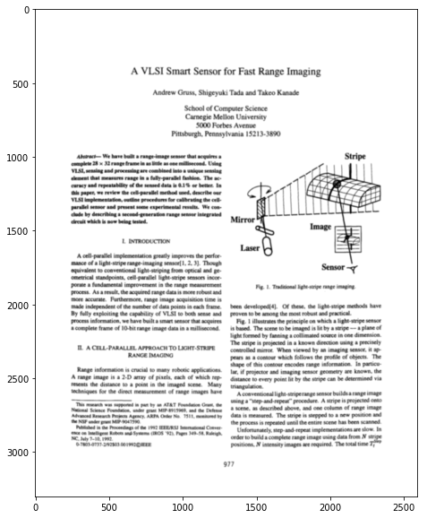


# PAGE ROTATION

This is just for illustration; for large page rotations, you can just use `ndimage`.


```python
for i, angle in enumerate([0, 90, 180, 270]):
    subplot(2, 2, i+1)
    imshow(ndi.rotate(image, angle))
```


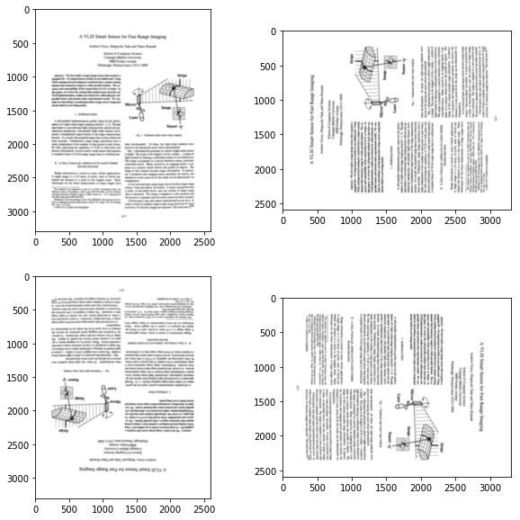


# RANDOM GEOMETRIC TRANSFORMATIONS

`random_transform` generates random transformation parameters that work reasonably well for document image degradation. You can override the ranges used by each of these parameters by keyword arguments.


```python
ocrodeg.random_transform()
```


    {'angle': -0.016783842893063807,
     'aniso': 0.805280370671964,
     'scale': 0.9709145529604223,
     'translation': (0.014319657859164045, 0.03676897986267606)}


Here are four samples generated by random transforms.


```python
for i in xrange(4):
    subplot(2, 2, i+1)
    imshow(ocrodeg.transform_image(image, **ocrodeg.random_transform()))
```


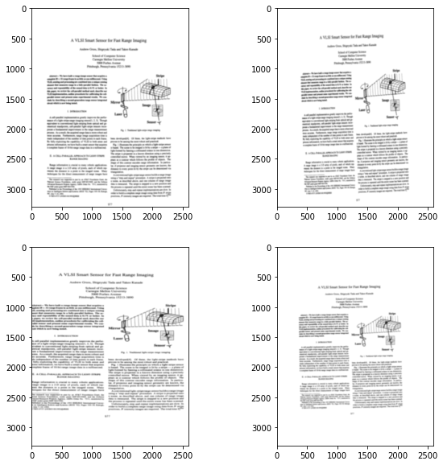


You can use `transform_image` directly with the different parameters to get a feel for the ranges and effects of these parameters.


```python
for i, angle in enumerate([-2, -1, 0, 1]):
    subplot(2, 2, i+1)
    imshow(ocrodeg.transform_image(image, angle=angle*pi/180))
```


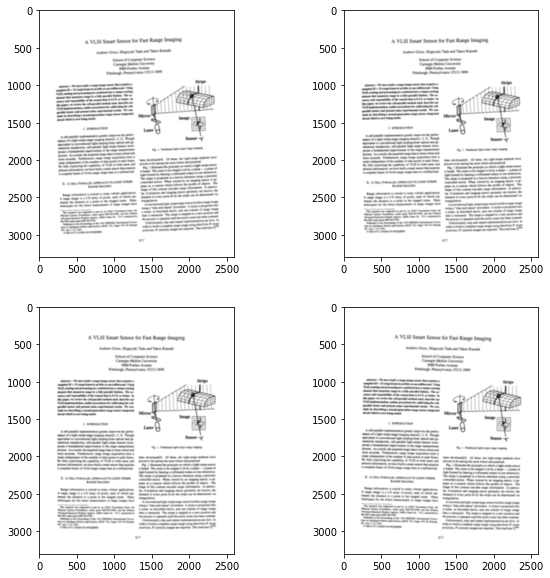


```python
for i, angle in enumerate([-2, -1, 0, 1]):
    subplot(2, 2, i+1)
    imshow(ocrodeg.transform_image(image, angle=angle*pi/180)[1000:1500, 750:1250])
```


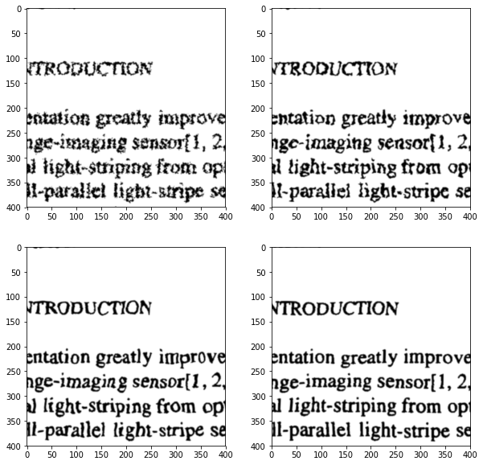


```python
for i, aniso in enumerate([0.5, 1.0, 1.5, 2.0]):
    subplot(2, 2, i+1)
    imshow(ocrodeg.transform_image(image, aniso=aniso))
```


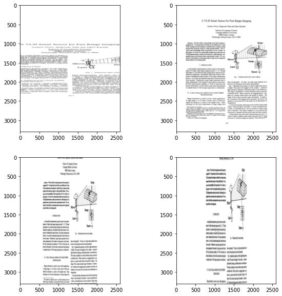


```python
for i, aniso in enumerate([0.5, 1.0, 1.5, 2.0]):
    subplot(2, 2, i+1)
    imshow(ocrodeg.transform_image(image, aniso=aniso)[1000:1500, 750:1250])
```


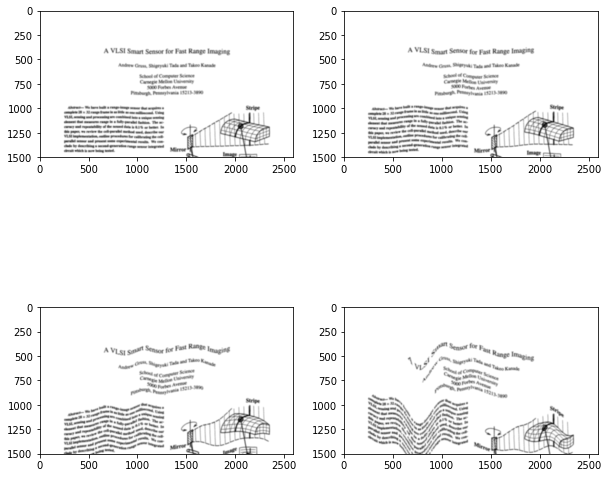


```python
for i, scale in enumerate([0.5, 0.9, 1.0, 2.0]):
    subplot(2, 2, i+1)
    imshow(ocrodeg.transform_image(image, scale=scale))
```


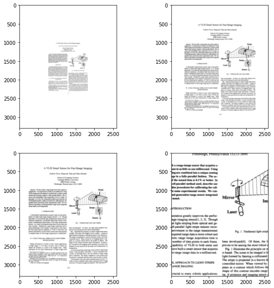


```python
for i, scale in enumerate([0.5, 0.9, 1.0, 2.0]):
    subplot(2, 2, i+1)
    h, w = image.shape
    imshow(ocrodeg.transform_image(image, scale=scale)[h//2-200:h//2+200, w//3-200:w//3+200])
```


# RANDOM DISTORTIONS

Pages often also have a small degree of warping. This can be modeled by random distortions. Very small and noisy random distortions also model ink spread, while large 1D random distortions model paper curl.


```python
for i, sigma in enumerate([1.0, 2.0, 5.0, 20.0]):
    subplot(2, 2, i+1)
    noise = ocrodeg.bounded_gaussian_noise(image.shape, sigma, 5.0)
    distorted = ocrodeg.distort_with_noise(image, noise)
    h, w = image.shape
    imshow(distorted[h//2-200:h//2+200, w//3-200:w//3+200])
```


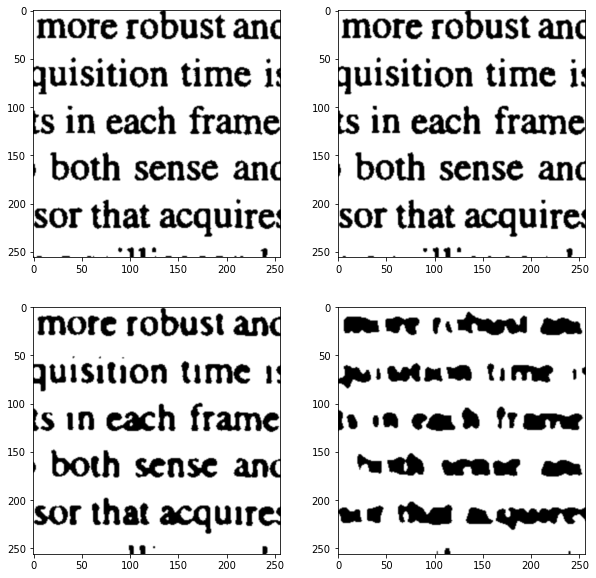


# RULED SURFACE DISTORTIONS


```python
for i, mag in enumerate([5.0, 20.0, 100.0, 200.0]):
    subplot(2, 2, i+1)
    noise = ocrodeg.noise_distort1d(image.shape, magnitude=mag)
    distorted = ocrodeg.distort_with_noise(image, noise)
    h, w = image.shape
    imshow(distorted[:1500])
```


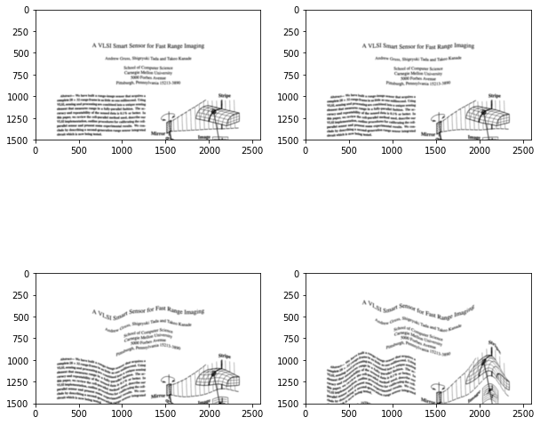


# BLUR, THRESHOLDING, NOISE

There are a range of utilities for modeling imaging artifacts: blurring, noise, inkspread.


```python
patch = image[1900:2156, 1000:1256]
imshow(patch)
```


    <matplotlib.image.AxesImage at 0x7fabc88c7e10>


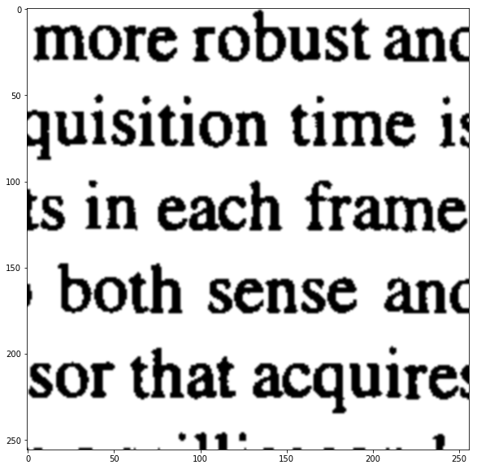


```python
for i, s in enumerate([0, 1, 2, 4]):
    subplot(2, 2, i+1)
    blurred = ndi.gaussian_filter(patch, s)
    imshow(blurred)
```


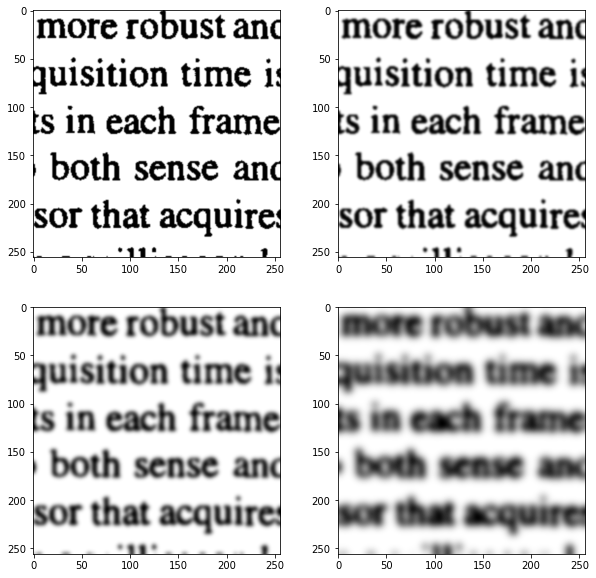


```python
for i, s in enumerate([0, 1, 2, 4]):
    subplot(2, 2, i+1)
    blurred = ndi.gaussian_filter(patch, s)
    thresholded = 1.0*(blurred>0.5)
    imshow(thresholded)
```


```python
reload(ocrodeg)
for i, s in enumerate([0.0, 1.0, 2.0, 4.0]):
    subplot(2, 2, i+1)
    blurred = ocrodeg.binary_blur(patch, s)
    imshow(blurred)

```


```python
for i, s in enumerate([0.0, 0.1, 0.2, 0.3]):
    subplot(2, 2, i+1)
    blurred = ocrodeg.binary_blur(patch, 2.0, noise=s)
    imshow(blurred)
```


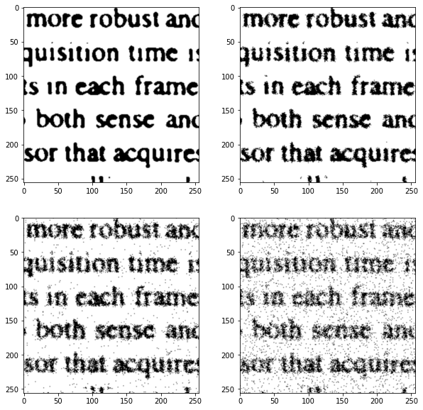


# MULTISCALE NOISE


```python
reload(ocrodeg)
for i in range(4):
    noisy = ocrodeg.make_multiscale_noise_uniform((512, 512))
    subplot(2, 2, i+1); imshow(noisy, vmin=0, vmax=1)
```


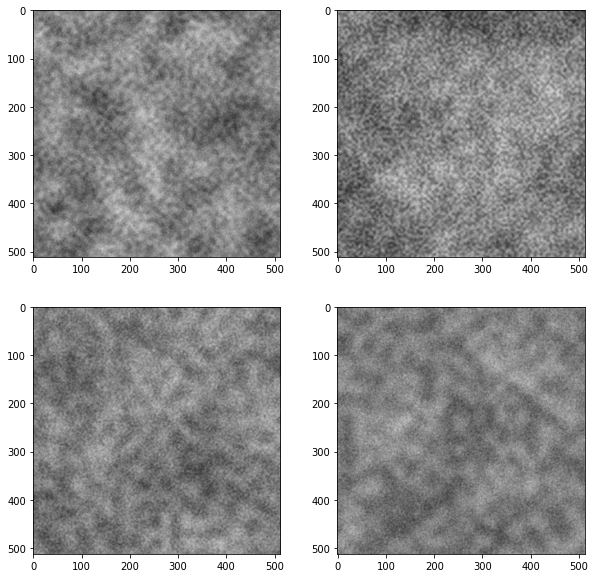


# RANDOM BLOBS


```python
for i, s in enumerate([2, 5, 10, 20]):
    subplot(2, 2, i+1)
    imshow(ocrodeg.random_blobs(patch.shape, 3e-4, s))
```


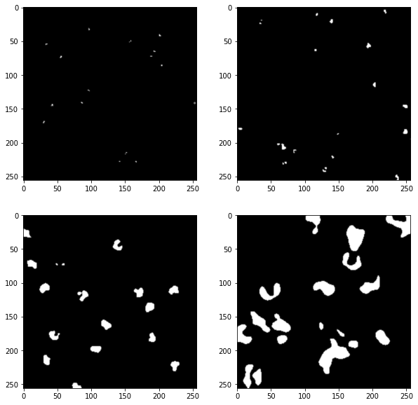


```python
reload(ocrodeg)
blotched = ocrodeg.random_blotches(patch, 3e-4, 1e-4)
#blotched = minimum(maximum(patch, ocrodeg.random_blobs(patch.shape, 30, 10)), 1-ocrodeg.random_blobs(patch.shape, 15, 8))
subplot(121); imshow(patch); subplot(122); imshow(blotched)
```


    <matplotlib.image.AxesImage at 0x7fabc8a35490>


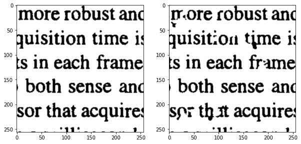


# FIBROUS NOISE


```python
imshow(ocrodeg.make_fibrous_image((256, 256), 700, 300, 0.01))
```


    <matplotlib.image.AxesImage at 0x7fabc8852450>


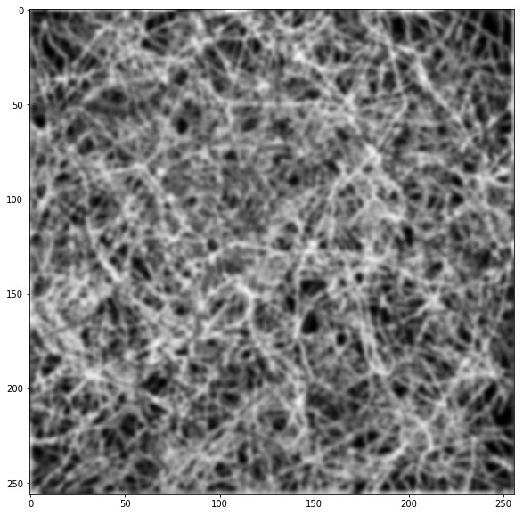


# FOREGROUND / BACKGROUND SELECTION


```python
subplot(121); imshow(patch); subplot(122); imshow(ocrodeg.printlike_multiscale(patch))
```


    <matplotlib.image.AxesImage at 0x7fabc8676d90>


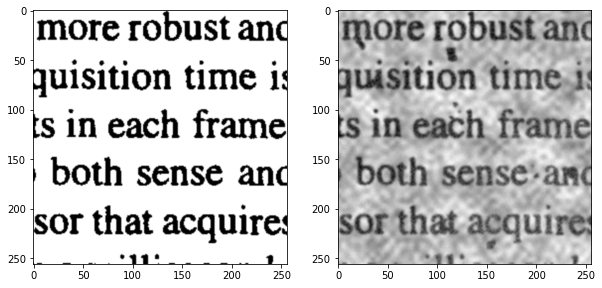


```python
subplot(121); imshow(patch); subplot(122); imshow(ocrodeg.printlike_fibrous(patch))
```


    <matplotlib.image.AxesImage at 0x7fabc8d1b250>


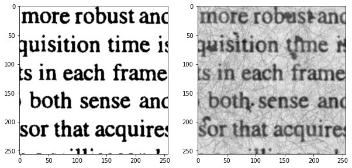

